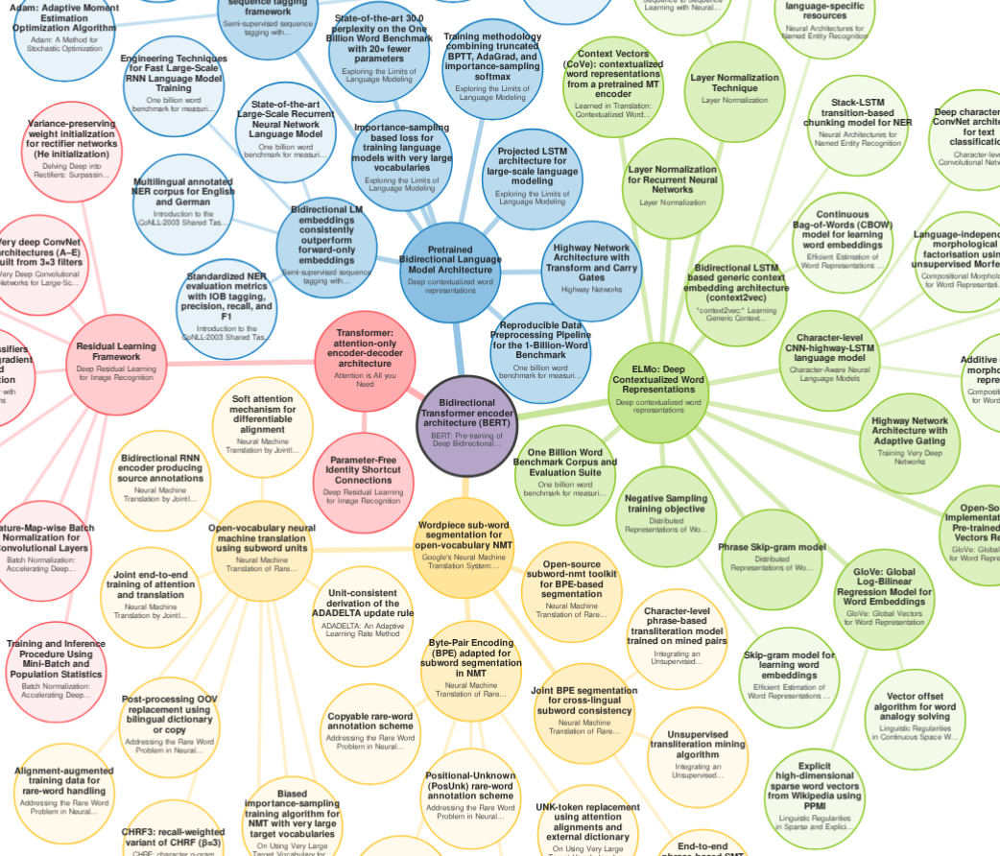
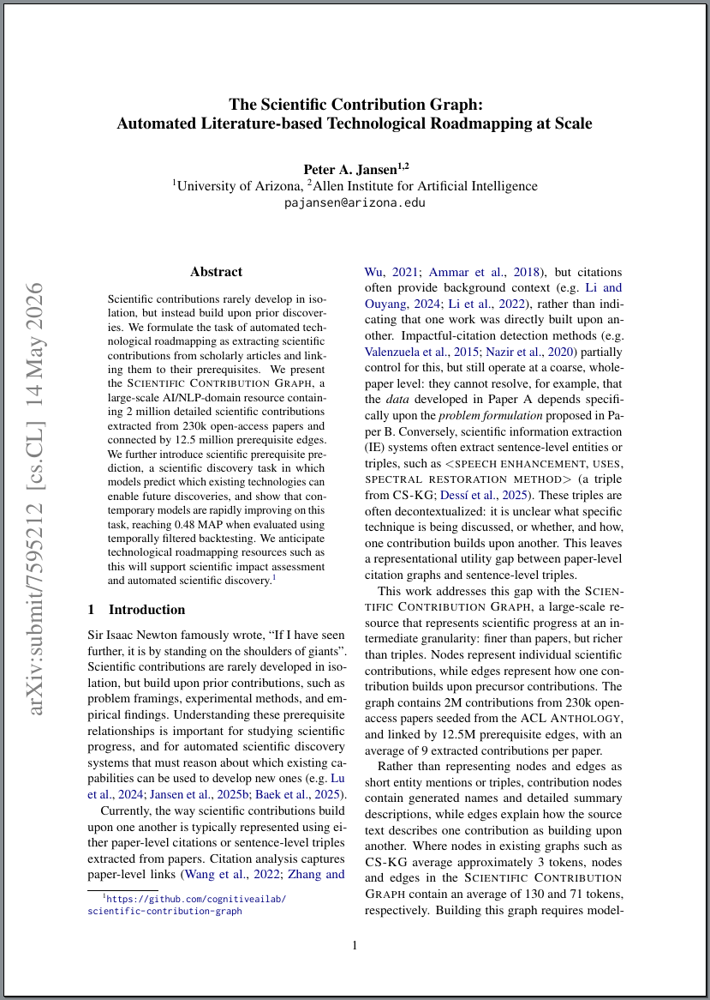
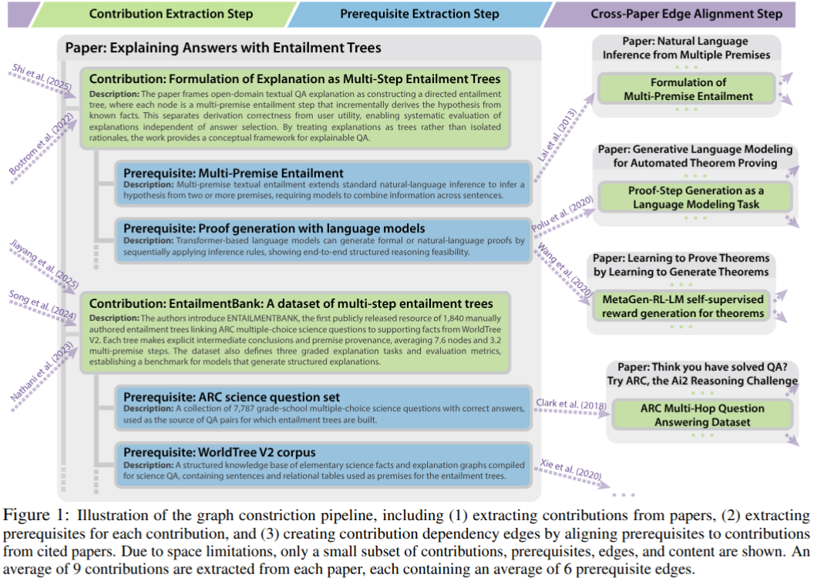
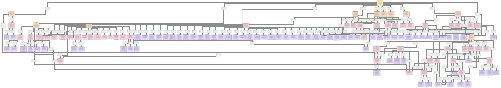
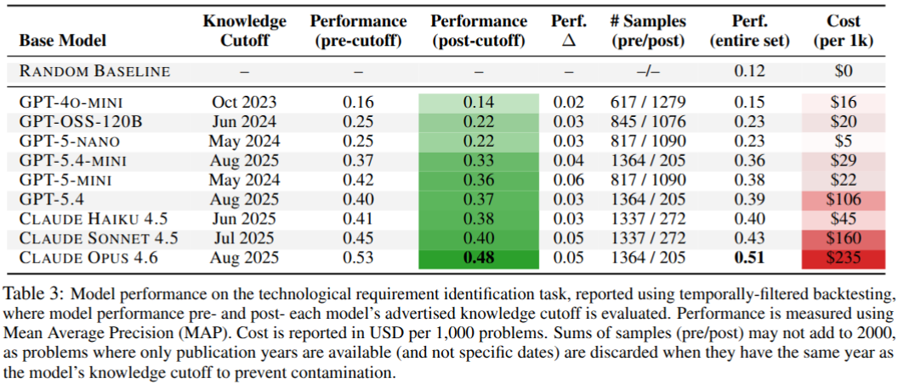

## The Scientific Contribution Graph
This is the repository for [The Scientific Contribution Graph: Automated Literature-based Technological Roadmapping at Scale](https://arxiv.org/pdf/2605.15011), and contains the API and installation instructions.

<table align="center"><tr><td></td></tr></table>

## What is this?
The Scientific Contribution Graph maps how science is "built upon the shoulders of giants" by extracting all the scientific contributions from scientific papers, and mapping how each contribution was built upon other contributions (i.e. its precursors).  For example, one of the most well-known scientific contributions in Natural Language Processing is the `Bidirectional Transformer Encoder Architecture (BERT)` from `Devlin et al. (2019)`.  BERT was built upon other (previously published) scientific contributions, including `Attention`, `Pretrained Bidirectional Language Models`, and `Contextualized Word Embedding`.  Each of these contributions (e.g. Attention) were themselves built upon contributions that came before them.  The Scientific Contribution Graph extracts both the scientific contributions from papers, as well as these "prerequisite relationships", to perform "technological roadmapping" -- or show how contributions have combined through the past to create new contributions. 

Several things make the Scientific Contribution Graph different than previous knowledge graphs.  First, its nodes and edges have *a lot* of content -- they include descriptions of each scientific contribution, and explanations of why each contribution's prerequisite is there, as well as why that prerequisite is filled by specific papers.  This is because the extraction is modeled as a full (expensive) sequence-to-sequence summarization/extraction task over the full text of each paper, using long-context models, rather than simply extracting triples or sentence spans.  So you don't just get a triple, like `entailment_tree, requires, multi_premise_entailment` -- you get detailed names and descriptions (an average of 130 tokens) of each scientific contribution, and detailed explanations of why one contribution is considered a prerequisite for another (using an average of 71 tokens). 

Second, the Scientific Contribution Graph is *large*.  It currently contains over *2 million* scientific contributions (and *12 million* prerequisite relations) extracted from over *230k* open access scientific articles, centrally in natural language processing and artificial intelligence.  In its current state, it likely maps out most of the technological roadmap of the field of natural language processing that is capable of being mapped using open access articles.

---

# Table of Contents

- [1. Paper](#1-paper)
- [2. Quick Start](#2-quick-start)
  - [2.1. Where can I download the scientific contribution graph, and how do I start using it?](#2-1-where-can-i-download)
  - [2.2. Are there examples of how to use the graph, extract subsets, create visualizations, or otherwise use the API?](#2-2-are-there-examples)
  - [2.3. How many scientific contributions are extracted per paper?](#2-3-how-many-contributions-per-paper)
  - [2.4. How are papers and contributions referenced?](#2-4-how-are-papers-and-contributions-referenced)
  - [2.5. Does the Scientific Contribution Graph contain only Artificial Intelligence articles?](#2-5-does-the-scg-contain-only-ai-articles)
  - [2.6. What do the nodes and edges in the Scientific Contribution Graph look like?](#2-6-what-do-the-nodes-and-edges-look-like)
  - [2.7. Are contributions extracted using abstracts, or full paper text?](#2-7-are-contributions-extracted-using-abstracts-or-full-paper-text)
  - [2.8. `Backward Crawl`, `Forward Crawl`, What do these terms mean?](#2-8-backward-crawl-forward-crawl)
  - [2.9. Can I use the Scientific Contribution Graph to measure the downstream impact of a specific paper, or a specific contribution in that paper?](#2-9-measure-downstream-impact)
  - [2.10. The paper describes a Technological Requirement Prediction task, for predicting what existing scientific contributions are needed to build a new scientific contribution.  Where can I find the code and data for that task?](#2-10-technological-requirement-prediction-task)
  - [2.11. I have a question not answered here.](#2-11-question-not-answered)
- [3. Installation and Running](#3-installation-and-running)
  - [3.1. System Requirements](#3-1-system-requirements)
  - [3.2. Installation Instructions](#3-2-installation-instructions)
- [4. Citation](#4-citation)
- [5. License](#5-license)
- [6. Contact](#6-contact)

---

<span id="1-paper"/>

## 1. Paper 

The Scientific Contribution Graph is described in the following paper: [The Scientific Contribution Graph: Automated Literature-based Technological Roadmapping at Scale [Arxiv/PDF]](https://arxiv.org/pdf/2605.15011).

<div align="center">
<table> <tr> <td>
        
</td> </tr> </table>
</div>

<span id="2-quick-start"/>

## 2. Quick Start

<span id="2-1-where-can-i-download"/>

### 2.1. Where can I download the scientific contribution graph, and how do I start using it?
The data for the graph is large (approximately 30GB on disk), and is currently distributed using a HuggingFace Datasets storage bucket.  The API for using the graph is contained in this repository.  To get started quickly, see [Section 3. Installation and Running](#3-installation-and-running).  After download, the getting up and running should take only a few minutes.

<span id="2-2-are-there-examples"/>

### 2.2. Are there examples of how to use the graph, extract subsets, create visualizations, or otherwise use the API?
Yes!  A set of cool and common examples and visualizations are included in the [examples/](examples/) page, including accessing contributions, backward/forward crawling, visualization, impact assessment, and others. 

<span id="2-3-how-many-contributions-per-paper"/>

### 2.3. How many scientific contributions are extracted per paper?
On average, each paper has 9 contributions.  On average, each contribution lists 6 prerequisites.  These prerequisites can be a mix of references to external papers, internal contributions (i.e. contributions from the same paper), or references to tools/URLs.  Currently, 61% are external papers, 33% are references to contributions in the same paper (typically when a later contribution builds upon an earlier one), and 6% are references to external tools/URLs.

<span id="2-4-how-are-papers-and-contributions-referenced"/>

### 2.4. How are papers and contributions referenced?
Papers are stored using their Semantic Scholar Corpus IDs, meaning that the Scientific Contribution Graph can seamlessly integrate with the [Semantic Scholar API](https://www.semanticscholar.org/product/api) and open research corpora.  Contributions are referenced as subsets of the Corpus IDs: So if a paper has corpus ID `12345`, then its contributions will be substrings like `12345.c1`, `12345.c2`, `12345.c3`, etc.

To find Corpus IDs for a given paper, you can use: 
- **Semantic Scholar API:** The easiest and best way is to use the Semantic Scholar API.
- **Paper title lookup:** The Scientific Contribution Graph includes a very rough-and-ready search that can find papers by title keywords, if needed.
- **Web Interface:** Semantic Scholar lists a paper's corpus ID at the top of its search page.  For example, for ["BERT: Pre-training of Deep Bidirectional Transformers for Language Understanding"](https://www.semanticscholar.org/paper/BERT%3A-Pre-training-of-Deep-Bidirectional-for-Devlin-Chang/df2b0e26d0599ce3e70df8a9da02e51594e0e992), the corpus ID is listed at the top: `Corpus ID: 52967399`

<span id="2-5-does-the-scg-contain-only-ai-articles"/>

### 2.5. Does the Scientific Contribution Graph contain only Artificial Intelligence articles?
The short answer is: mostly.  The longer answer is: The crawl is initially seeded from the [ACL Anthology](https://aclanthology.org/), meaning that any open access papers cited by ACL Anthology papers (or, papers that cite those papers, recursively) will be attempted to be crawled.  The longer-term goal is for the graph to be expanded into other domains, though this is limited by open access literature availability (which is plentiful in the AI domain). 

<span id="2-6-what-do-the-nodes-and-edges-look-like"/>

### 2.6. What do the nodes and edges in the Scientific Contribution Graph look like?
Here is what the nodes and edges represent: 
- Nodes represent individual scientific contributions extracted from papers.  Scientific contributions are usually much finer-grained than papers, and here the extraction system tends to extract an average of 9 contributions per paper.
- Edges represent "precursor" relationships, which means that `A was developed using B`. For example, `BERT` was developed using `Attention`, `Pretrained Bidirectional Language Models`, and `Contextualized Word Embedding`, so each of these are precursor contributions to BERT.

The nodes and edges contain a great deal of data. For example: 
- Nodes contain the names of contributions, detailed summary descriptions, and metadata, including multi-label classifications of the contributions, the associated paper sections they're mentioned in, source paper information, etc.
- Edges are quite detailed.  Nodes contain lists of precursor technologies, with descriptions, and explanations for why they are precursors.  They also include a classification of whether the precursor is thought to be a `core` requirement, or a `peripheral` requirement.  For each precursor, a list of references are provided.  For those referenced papers that have been processed, the reference will also include UUIDs to specific contributions that satisfy the prerequisite (the nominal `cross-contribution edge`).

All this is to say -- there's a lot of information in this graph, and it's far more detailed than something like a triple graph.  The easiest way to help ground this is to [look at example data](examples/example2_output_plain_text_paper_claims.txt) . Figure 1 in the paper also helps illustrate the organizational structure of the graph, and shows some of the node content (e.g. the contribution names and descriptions):

<table align="center"><tr><td></td></tr></table>

Adding in more knowledge from the Scientific Contribution Graph quickly makes visualization challenging.  For example, here is a backward-crawl graph that includes some edge content (added in as the small teal nodes): 

<table align="center"><tr><td>
<a href="examples/backward_crawl_example_results.graphviz.edgelabels.pdf">

</a>
</td></tr></table>

<span id="2-7-are-contributions-extracted-using-abstracts-or-full-paper-text"/>

### 2.7. Are contributions extracted using abstracts, or full paper text?
The contributions are extracted using the full-paper text, so detailed contributions not found in abstracts are also often extracted.

<span id="2-8-backward-crawl-forward-crawl"/>

### 2.8. `Backward Crawl`, `Forward Crawl`, What do these terms mean?
In the context of the scientific contribution graph:
- *Backward crawling from a Contribution X*: Determining which technologies Contribution X was built from (i.e. backwards in time).
- *Forward crawling from a Contribution X*: Determining which technologies built off of Contribution X (i.e. forwards in time).

<span id="2-9-measure-downstream-impact"/>

### 2.9. Can I use the Scientific Contribution Graph to measure the downstream impact of a specific paper, or a specific contribution in that paper?
Yes, in multiple ways.
- **Visualization:** If you'd like a visualization of how a specific contribution led to further contributions (i.e. its impact), see the `forward crawling` example code here: [examples/](examples/) . There are examples visualizing this as a [simple radial graph where nodes are contribution names](examples/forward_crawl_example_results.radial-iter500.svg), and also slightly more [detailed graphs that include contribution descriptions](examples/forward_crawl_example_results.graphviz.edgelabels.pdf)
- **Impact Number:** If you'd like a citation-like number (e.g. a count of the number of downstream scientific contributions that were made possible from a specific paper or contribution), see the `impact` example code here: [examples/](examples/).  The summary report includes impact both across an entire paper, and broken down for each contribution [(see an example here)](examples/example6_impact_metric.json) .

A caveat of impact assessment is that since the graph is largely crawled in the `prerequisite` (i.e. backwards) direction during the extraction process, there will be lower recall in the `impact` (i.e. forwards) direction.  That means: whatever impact it says a contribution has had, the true impact is likely higher, particularly if that impact comes from papers (a) that are not open access, or (b) that are not in the AI/NLP domain.

<span id="2-10-technological-requirement-prediction-task"/>

### 2.10. The paper describes a Technological Requirement Prediction task, for predicting what existing scientific contributions are needed to build a new scientific contribution.  Where can I find the code and data for that task?

The technological requirement prediction task code and data is provided in: [task_precursor_prediction/](task_precursor_prediction/) 

This includes: 
- **Data:** The same 2000 problems used to generate Table 3 in the paper.
- **Benchmark Code:** The same code used to generate the benchmark results in Table 3 in the paper.
- **Example Code:** A runnable example/API function to perform this task in real life scientific prediction, along with example output.

<table align="center"><tr><td></td></tr></table>

<span id="2-11-question-not-answered"/>

### 2.11. I have a question not answered here. 
Please see the documentation below.  If you're question isn't answered, please add an issue, or send an e-mail: [Section 6. Contact](#6-contact)


<span id="3-installation-and-running"/>

## 3. Installation and Running

The installation has been tested working on Ubuntu Linux.  It will likely work with minimal modification on MacOS, and some modification under Windows.

<span id="3-1-system-requirements"/>

### 3.1. System Requirements

The Scientific Contribution Graph API is intentionally designed to be light-weight, and all the contribution data is streamed from disk, so the memory and compute requirements are low (a few gigabytes).  When search embeddings are enabled, this does increase RAM requirements somewhat, to approximately 10GB.

<span id="3-2-installation-instructions"/>

### 3.2. Installation Instructions

#### Step 1: Download the latest Scientific Contribution Graph 

The Scientific Contribution Graph is stored on [HuggingFace Datasets](https://huggingface.co/datasets) in a bucket, as it is quite large (~7GB zipped, ~34GB unzipped). 

#### Step 1.1: Install Huggingface Datasets Command Line Interface

**Command Line Interface:** You can install the Huggingface command line interface with `pip`:
```
pip install -U huggingface_hub[hf_transfer]
```

#### Step 1.2: Download the bucket and extract
Create a directory that you'd like to store the large scientific contribution graph data in, and enter it, such as:
```
mkdir ~/sci-cont-graph/
cd ~/sci-cont-graph/
```

You can list the size of the latest graph in `/releases-tar/current/`:
```
> hf buckets ls hf://buckets/pajansen/scientific-contribution-graph/releases-tar/current/

  6483552957  2026-05-12 21:49:53  releases-tar/current/scg-release-1.0.0.tar.gz
          91  2026-05-12 21:49:54  releases-tar/current/scg-release-1.0.0.tar.gz.sha256
```

Then download the archive and `sha256`:
```
> hf buckets sync hf://buckets/pajansen/scientific-contribution-graph/releases-tar/current . --verbose

Scanning remote bucket (2 files)
Scanning local directory (0 files)
Comparing files (2 paths)
Sync plan: hf://buckets/pajansen/scientific-contribution-graph/releases-tar/current -> .
  Uploads: 0
  Downloads: 2
  Deletes: 0
  Skips: 0
Syncing...
  Downloading: scg-release-1.0.0.tar.gz (new file)
  Downloading: scg-release-1.0.0.tar.gz.sha256 (new file)
Downloading 2 files
Downloading bucket files: 100%|██████████████████████████████████████████████████████████████████████████████████████████████████████████████████████████████████████████████████████████████████████████████████████████| 6.48G/6.48G [01:18<00:00, 82.2MB/s]
Sync completed.
```

And you can verify the `sha256`: 
```
> sha256sum -c scg-release-1.0.0.tar.gz.sha256

scg-release-1.0.0.tar.gz: OK
```

Then, extract the archive using tar: 
```
tar -xzvf scg-release-1.0.0.tar.gz
```

If you'd like, you can verify the overall structure of the archive:
```
> ls
data
scg-release-1.0.0.tar.gz
scg-release-1.0.0.tar.gz.sha256

> ls data/
embeddings
metadata
papers

> ls data/metadata/
corpus_id_to_paper_year.json
dataset_manifest.json
forward_references.json
paper_manifest.jsonl
paper_title_to_corpus_id.json
```

Similarly, `du` can be used to verify the size: 
```
> du -lh

...
1.5G    ./data/papers/23
89M     ./data/papers/37
2.1G    ./data/papers/26
24G     ./data/papers
4.0G    ./data/embeddings
28G     ./data
34G     .
```


#### Step 2: Download the repository, and setup the environment:

Clone the repository: 
```
git clone https://github.com/cognitiveailab/scientific-contribution-graph.git
cd scientific-contribution-graph
```

(Optional) Create a conda or other virtual environment:
```
conda create --name=scicontgraph python=3.12
conda activate scicontgraph
```

Install the scientific contribution graph repository as a library: 
```
pip install -e .
```

Install the requirements using pip: 
```
pip install -r requirements.txt
```

#### Step 3: Run an example to verify the install

A number of ready-made examples of the API are available to run in the `example_graph_use.py` file here: [examples/](examples/)


<span id="4-citation"/>

## 4. Citation
If you use this work, please reference the following citation:
```
@misc{jansen2026scientificcontributiongraphautomated,
      title={The Scientific Contribution Graph: Automated Literature-based Technological Roadmapping at Scale}, 
      author={Peter A. Jansen},
      year={2026},
      eprint={2605.15011},
      archivePrefix={arXiv},
      primaryClass={cs.CL},
      url={https://arxiv.org/abs/2605.15011}, 
}
```

<span id="5-license"/>

## 5. License

The Scientific Contribution Graph code is released under an Apache 2.0 License.  The text of that license is included in this repository.

```
Disclaimer of Warranty. Unless required by applicable law or
agreed to in writing, Licensor provides the Work (and each
Contributor provides its Contributions) on an "AS IS" BASIS,
WITHOUT WARRANTIES OR CONDITIONS OF ANY KIND, either express or
implied, including, without limitation, any warranties or conditions
of TITLE, NON-INFRINGEMENT, MERCHANTABILITY, or FITNESS FOR A
PARTICULAR PURPOSE. You are solely responsible for determining the
appropriateness of using or redistributing the Work and assume any
risks associated with Your exercise of permissions under this License.
```

The original papers are open access papers taken from permissively licensed sources (the ACL Anthology and S2ORC), and retain their original licenses.

*Disclosure:* Some aspects of this work involved using large language models as assistants, particularly in generating the embedding-based search code in the API, which is largely LLM generated.

<span id="6-contact"/>

## 6. Contact

For any questions, please contact Peter Jansen (`pajansen@arizona.edu`).  For issues, bugs, or feature requests, please submit a Github issue.
```
