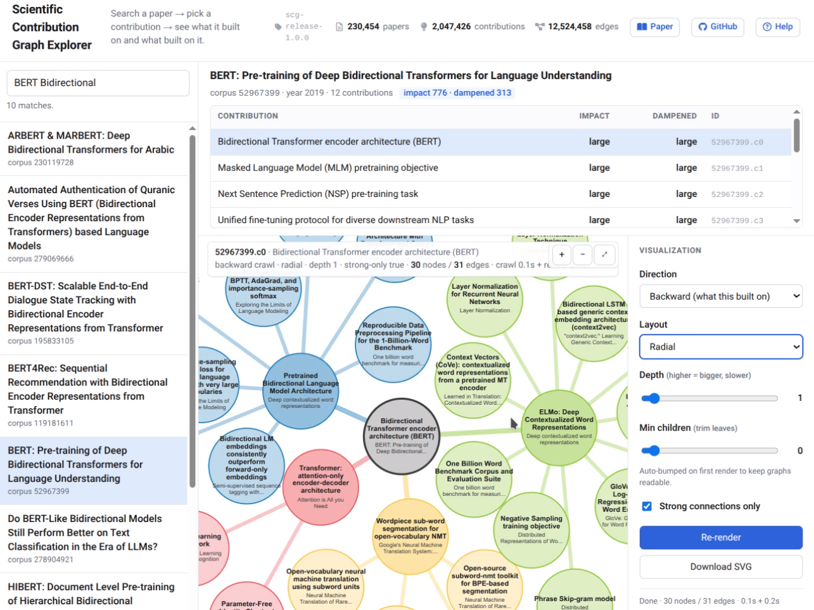

# Live Demo (web-based, and local)

<table align="center"><tr><td></td></tr></table>


## Web Demo (Live)
There is a live demo visualization of the scientific contribution graph available on Huggingface Spaces here: https://huggingface.co/spaces/pajansen/scientific-contribution-graph

## Video of Demo Usage

TODO

## Local Demo (Install on your machine)

You can also install the demo for local use (which tends to run significantly faster than on Huggingface Spaces).  After following the normal installation instructions, follow these additional steps:

**Step 1:** Install the additional demo requirements
```
cd demo
pip install -e requirements.txt
```

Don't forget to also install `graphviz/dot` for the tree-based visualizations. 


**Step 2:** Point the demo configuration file (`demo_config.json`) to the location you downloaded the scientific contribution graph to in the `data_path` key: 
```
{
  "data_path":  "/data-ssd2/temp1/",
  "bucket_uri": "hf://buckets/pajansen/scientific-contribution-graph/releases-tar/current",

  "host": "0.0.0.0",
  "port": 7860,

  "impact_timeout_secs": 20,
  "render_timeout_secs": 45
}
```
If you don't set this, it will attempt to re-download the scientific contribution graph to this location, which can take some time to download, then an additional ~20+ minutes to extract.
If the directory does not exist, the demo will throw an error and exit. 

**Step 3:** Run the demo
```
cd ..
python demo/demo.py --port 7860
```

**Step 4:** Point your browser to `localhost:7860`
The demo interface should now be available. 


