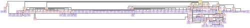
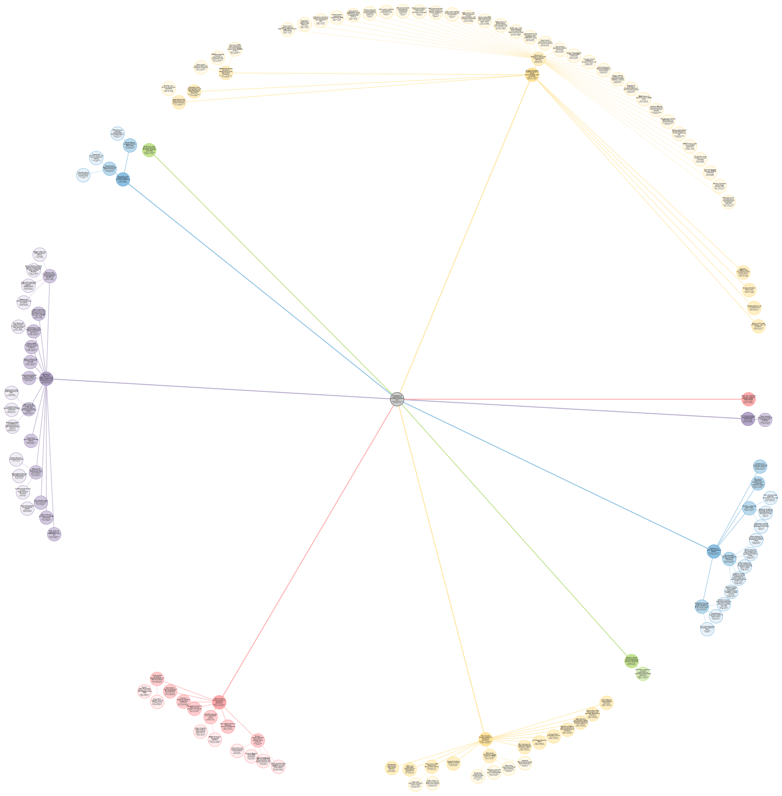
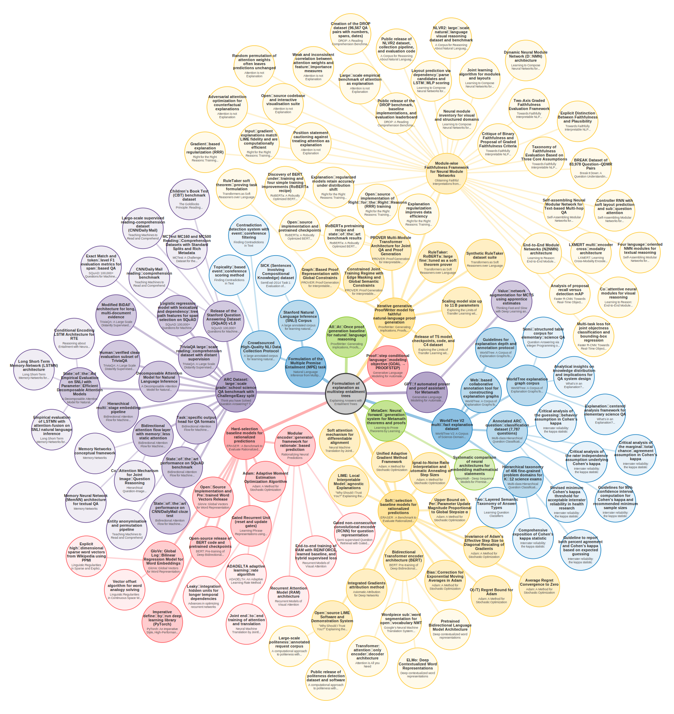
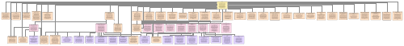
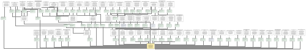
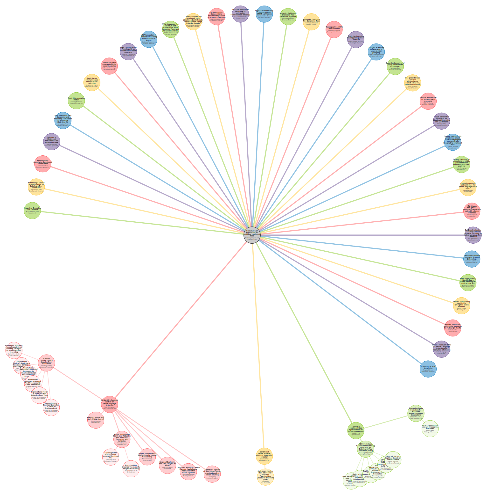
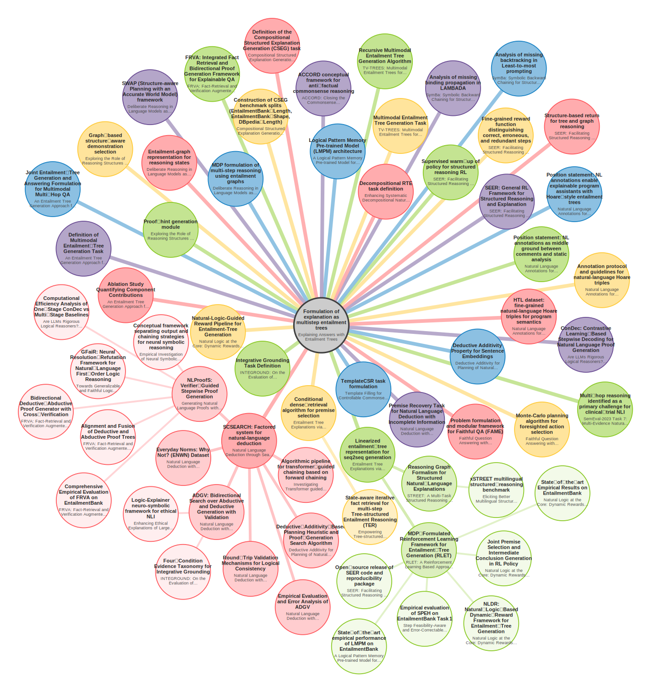

# Scientific Contribution Graph: Examples / API Usage

This directory contains a runnable walkthrough of the most common ways to use the
`ScientificContributionGraph` API, along with the artifacts produced by each example.

## Code

All examples live in a single script:

- **[`example_graph_use.py`](example_graph_use.py)** -- runnable, self-contained examples
  covering paper lookup, contribution inspection, backward/forward graph crawling,
  impact metric computation, and semantic search.

To run, edit `path_to_graph_data` at the bottom of the file to point at your local
copy of the graph, then uncomment the example(s) you want to execute and run:

```bash
python example_graph_use.py
```

Note: `search_enabled = True` enables the dense semantic search index. Loading it uses approximately 10 GB of memory.


## Examples

### Example 1: Find a paper by its title
Papers (and contributions) are referenced according to the paper's corresponding Semantic Scholar (S2) corpus ID. This is nominally available using the Semantic Scholar API (...), but the Scientific Contribution Graph API also has functionality to perform a quick (rough-and-ready) title search to recover a Semantic Scholar `corpus_id` from a paper title (full or partial).

*Example:*
```
search_and_print("Explaining Answers entailment Trees")

output = [
  {'score': 1.0, 'corpus_id': '233297051', 'paper_title': 'Explaining Answers with Entailment Trees'}
  {'score': 0.5, 'corpus_id': '14805503', 'paper_title': 'DLSITE-2: Semantic Similarity Based on Syntactic Dependency Trees Applied to Textual Entailment'}
  {'score': 0.5, 'corpus_id': '250390963', 'paper_title': 'Explaining Neural NLP Models for the Joint Analysis of Open- and Closed-Ended Survey Answers'}
  ...
]
```

### Example 2: Display all contributions and prerequisites for a paper
Loads a paper by `corpus_id` and prints every contribution it makes, along with
each contribution's prerequisites, references, and matched downstream contributions.
- Output (plain text): [`example2_output_plain_text_paper_claims.txt`](example2_output_plain_text_paper_claims.txt)

### Example 2A: Same as Example 2, but as JSON
Dumps the full internal representation of a paper (contributions, prerequisites,
references, matches) to a single JSON file.
- Output (JSON): [`example2a_paper_contributions.json`](example2a_paper_contributions.json)

### Example 3: Inspect a single contribution by `contribution_id`
Fetches one specific contribution node and prints its description, types,
section provenance, prerequisites, and matched references.
*Output: console only (see comments inline).*

### Example 3A: Same as Example 3, but as JSON
Dumps a single contribution (plus its paper info) to JSON.
- Output (JSON): [`example3a_specific_contribution.json`](example3a_specific_contribution.json)

### Example 4: Backward crawl from a contribution (with visualizations)
Traverses the prerequisite graph **backwards** from a given contribution to surface
everything that contribution depends on (directly or indirectly), and renders the
result as JSON, Graphviz, and a radial SVG tree.

- Crawl results (JSON): [`backward_crawl_example_results.json`](backward_crawl_example_results.json)

| Graphviz (simple) | Graphviz (edge labels as nodes) |
|---|---|
| <a href="backward_crawl_example_results.graphviz.pdf"></a> | <a href="backward_crawl_example_results.graphviz.edgelabels.pdf"></a> |
| [`.dot`](backward_crawl_example_results.graphviz.dot) / [`.pdf`](backward_crawl_example_results.graphviz.pdf) | [`.dot`](backward_crawl_example_results.graphviz.edgelabels.dot) / [`.pdf`](backward_crawl_example_results.graphviz.edgelabels.pdf) |

| Radial SVG (initial layout) | Radial SVG (after relaxation) |
|---|---|
| <a href="backward_crawl_example_results.radial-iter1.svg"></a> | <a href="backward_crawl_example_results.radial-iter500.svg"></a> |
| [`.svg`](backward_crawl_example_results.radial-iter1.svg) | [`.svg`](backward_crawl_example_results.radial-iter500.svg) |

### Example 5: Forward crawl from a contribution (with visualizations)
Traverses the prerequisite graph **forwards** to surface every contribution that
builds upon a given contribution (directly or indirectly), again with JSON,
Graphviz, and radial SVG renderings.

- Crawl results (JSON): [`forward_crawl_example_results.json`](forward_crawl_example_results.json)

| Graphviz (simple) | Graphviz (edge labels as nodes) |
|---|---|
| <a href="forward_crawl_example_results.graphviz.pdf"></a> | <a href="forward_crawl_example_results.graphviz.edgelabels.pdf"></a> |
| [`.dot`](forward_crawl_example_results.graphviz.dot) / [`.pdf`](forward_crawl_example_results.graphviz.pdf) | [`.dot`](forward_crawl_example_results.graphviz.edgelabels.dot) / [`.pdf`](forward_crawl_example_results.graphviz.edgelabels.pdf) |

| Radial SVG (initial layout) | Radial SVG (after relaxation) |
|---|---|
| <a href="forward_crawl_example_results.radial-iter1.svg"></a> | <a href="forward_crawl_example_results.radial-iter500.svg"></a> |
| [`.svg`](forward_crawl_example_results.radial-iter1.svg) | [`.svg`](forward_crawl_example_results.radial-iter500.svg) |

- Legacy single-pass renderings: [`forward_crawl_example_results.dot`](forward_crawl_example_results.dot) / [`.pdf`](forward_crawl_example_results.pdf)

### Example 6: Impact metric for a paper
Computes a contribution-aware citation/impact metric for every contribution in a
paper, plus an overall paper-level score. Also reports a depth-dampened variant
(reciprocal-rank weighting over crawl depth).
- Output (JSON): [`example6_impact_metric.json`](example6_impact_metric.json)

### Example 7: Semantic search over contributions
Runs a dense-embedding search over all contribution nodes for a free-form query
and returns the top-K hits with cosine scores and paper metadata.
*(Requires `search_enabled=True` when loading the graph.)*
- Output (JSON): [`example7_search_results.json`](example7_search_results.json)


## File index (alphabetical)

| File | Produced by |
|---|---|
| [`backward_crawl_example_results.json`](backward_crawl_example_results.json) | Example 4 |
| [`backward_crawl_example_results.graphviz.dot`](backward_crawl_example_results.graphviz.dot) | Example 4 |
| [`backward_crawl_example_results.graphviz.pdf`](backward_crawl_example_results.graphviz.pdf) | Example 4 |
| [`backward_crawl_example_results.graphviz.edgelabels.dot`](backward_crawl_example_results.graphviz.edgelabels.dot) | Example 4 |
| [`backward_crawl_example_results.graphviz.edgelabels.pdf`](backward_crawl_example_results.graphviz.edgelabels.pdf) | Example 4 |
| [`backward_crawl_example_results.radial-iter1.svg`](backward_crawl_example_results.radial-iter1.svg) | Example 4 |
| [`backward_crawl_example_results.radial-iter500.svg`](backward_crawl_example_results.radial-iter500.svg) | Example 4 |
| [`example2_output_plain_text_paper_claims.txt`](example2_output_plain_text_paper_claims.txt) | Example 2 |
| [`example2a_paper_contributions.json`](example2a_paper_contributions.json) | Example 2A |
| [`example3a_specific_contribution.json`](example3a_specific_contribution.json) | Example 3A |
| [`example6_impact_metric.json`](example6_impact_metric.json) | Example 6 |
| [`example7_search_results.json`](example7_search_results.json) | Example 7 |
| [`example_graph_use.py`](example_graph_use.py) | (source) |
| [`forward_crawl_example_results.json`](forward_crawl_example_results.json) | Example 5 |
| [`forward_crawl_example_results.graphviz.dot`](forward_crawl_example_results.graphviz.dot) | Example 5 |
| [`forward_crawl_example_results.graphviz.pdf`](forward_crawl_example_results.graphviz.pdf) | Example 5 |
| [`forward_crawl_example_results.graphviz.edgelabels.dot`](forward_crawl_example_results.graphviz.edgelabels.dot) | Example 5 |
| [`forward_crawl_example_results.graphviz.edgelabels.pdf`](forward_crawl_example_results.graphviz.edgelabels.pdf) | Example 5 |
| [`forward_crawl_example_results.radial-iter1.svg`](forward_crawl_example_results.radial-iter1.svg) | Example 5 |
| [`forward_crawl_example_results.radial-iter500.svg`](forward_crawl_example_results.radial-iter500.svg) | Example 5 |
```
